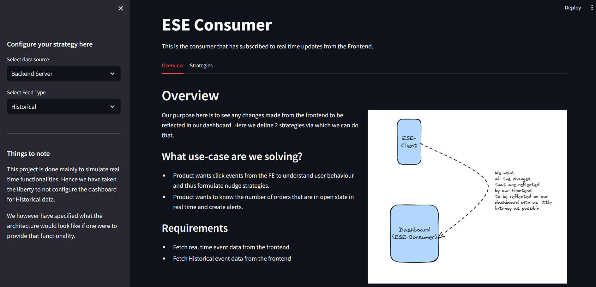
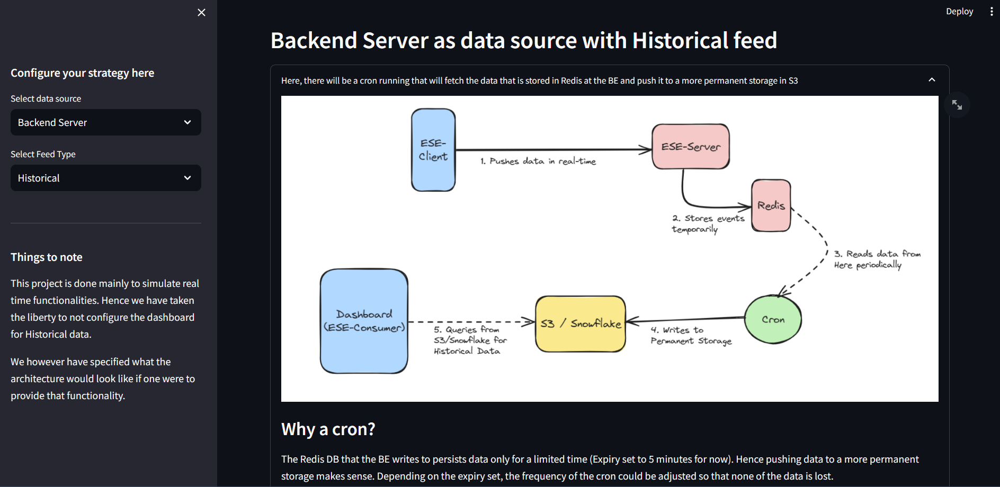
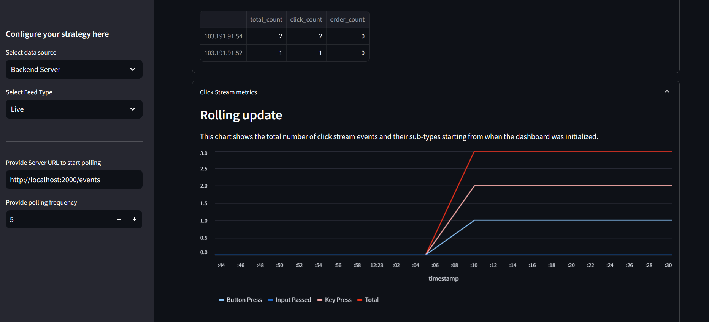

# ESE-Consumer

This code here acts as the consumer of the events that are generated by the `ese-client` and pushed downstream by the `ese-server`. This can be anything. It can be another microservice that consumes these events, any alerts that are configured, or anything.

For our example, we have kept this as a dashboard that would want to consume these events so as to gain insights into it. Run the application to know more.

- **Languge :** [Python 3.9](https://docs.python.org/3.9/)
- **Framework :** [Streamlit](https://docs.streamlit.io/library/api-reference)

---

## Screenshots







---

## Running Locally

It is recommended that first a virtual environment is set using the `python3 -m venv .venv` before running the following lines. After this, the app will be running on `http://localhost:8501`

```bash
pip install -r requirements.txt
streamlit run app.py
```

---

## Running Via Docker

The following command will initialize the docker container and expose our application on port `8501`

```bash
docker run -it -p 8501:8501 --name ese-consumer saumyabhatt10642/ese-consumer
```

---

## Pushing Image

Pushing any changes to the master will trigger a GitHub action to push the master as a docker image to the `latest` tag in DockerHub. If you wish to create a new image with a different tag, follow the below-given commands:

[DockerHub Repository](https://hub.docker.com/repository/docker/saumyabhatt10642/ese-consumer/general)

```bash
docker image build -t ese-consumer:tag .
docker image tag ese-consumer:tag saumyabhatt10642/ese-consumer:tag
docker push saumyabhatt10642/ese-consumer:tag
```
