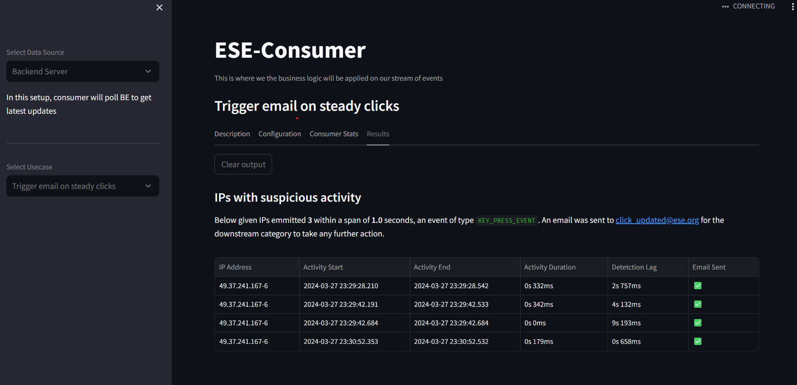

# ESE-Consumer

This repo houses the logic that consumes the events and performs certain logic on them.

Currently, for our example, the usecase here is to consume click stream events in as near-real-time and possible. And if a certain criteria is met, it will trigger an email from the [ESE-Mailer](https://github.com/Event-Streaming-Example/ese-mailer)

- **Languge :** [Python 3.9](https://docs.python.org/3.9/)
- **Framework :** [Streamlit](https://docs.streamlit.io/library/api-reference)

---

## Screenshots




---

## Running Locally

We will be using [pipenv](https://pypi.org/project/pipenv/) to manage our dependencies. So make sure to install that first.

```bash
pipenv install
pipenv shell
streamlit run app.py
```

---

## Running Via Docker

The following command will initialize the docker container and expose our application on port `8501`

```bash
docker run -it -p 8501:8501 --name ese-consumer saumyabhatt10642/ese-consumer
```

---

## Pushing Image

Pushing any changes to the master will trigger a GitHub action to push the master as a docker image to the `latest` tag in DockerHub. If you wish to create a new image with a different tag, follow the below-given commands:

[DockerHub Repository](https://hub.docker.com/repository/docker/saumyabhatt10642/ese-consumer/general)

```bash
docker image build -t ese-consumer:tag .
docker image tag ese-consumer:tag saumyabhatt10642/ese-consumer:tag
docker push saumyabhatt10642/ese-consumer:tag
```
